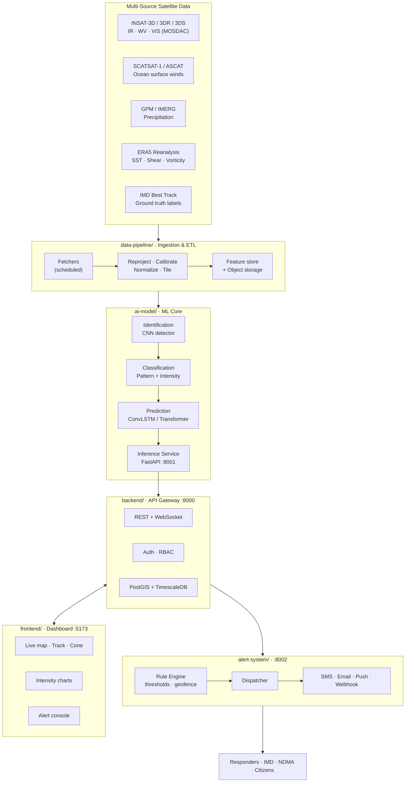

# Vayu-X — AI/ML Tropical Cyclone Intelligence System

> **Smart India Hackathon 2026** · Problem Statement **26070**
> **Team No.** 152 · **Team Name** Vayu-X

An AI/ML system for **identification**, **classification**, and **prediction** of tropical
cyclone patterns over the North Indian Ocean using **multi-source satellite data**.

| | |
|---|---|
| **Problem Statement ID** | 26070 |
| **Organization** | Ministry of Earth Sciences (MoES) |
| **Department** | India Meteorological Department (IMD) |
| **Category** | Software |
| **Theme** | Disaster Management |

---

## 1. Problem in one paragraph

IMD currently relies heavily on the **Dvorak technique** — a manual, analyst-driven method of
reading cloud patterns in satellite imagery to estimate cyclone intensity. It is subjective,
slow, and inconsistent between analysts. Meanwhile INSAT-3D/3DR alone push out a half-hourly
full-disk scan, and scatterometer, microwave, and reanalysis products add several more streams.
No human team can fuse all of that in real time. **Vayu-X automates the loop**: ingest
multi-source satellite data → detect and locate cyclonic systems → classify their pattern and
intensity → forecast track and intensity → push graded alerts to responders before landfall.

## 2. What the system does

| Stage | Capability | Approach |
|---|---|---|
| **Identify** | Detect and geo-locate cyclonic systems / eye centre from full-disk imagery | CNN + attention-based detector over IR (TIR-1), WV, and VIS channels |
| **Classify** | Cloud pattern type (CDO, banding, shear, eye, curved band) + intensity category (D, DD, CS, SCS, VSCS, ESCS, SuCS) | Deep classifier trained against IMD best-track / Dvorak T-number labels |
| **Predict** | Track (lat/lon) and intensity for T+6h … T+72h | ConvLSTM / spatio-temporal transformer over image sequences + reanalysis features |
| **Alert** | Graded, geo-fenced warnings to authorities and citizens | Rule engine over predictions → multi-channel dispatch (SMS / email / push / webhook) |
| **Visualize** | Live dashboard: satellite overlay, cyclone track, cone of uncertainty, intensity timeline | React + Leaflet geospatial dashboard |

## 3. Architecture



Full detail: [`docs/architecture.md`](docs/architecture.md)

## 4. Repository structure

```
SIH_Project/
├── frontend/          React + Vite dashboard (map, tracks, charts, alert console)
├── backend/           FastAPI API gateway — auth, orchestration, persistence, WebSocket
├── ai-model/          ML core — datasets, training, evaluation, inference microservice
├── alert-system/      Rule engine + multi-channel alert dispatcher
├── data-pipeline/     Satellite ingestion, ETL, feature store loading, scheduler
├── shared/            Cross-service JSON schemas (the service contract)
├── infra/             nginx, k8s manifests, monitoring configs
├── scripts/           Setup / bootstrap / sample-data helpers
├── docs/              Architecture, data sources, ML approach, API contract, roadmap
├── .github/           CI workflows, PR template
└── docker-compose.yml One-command local stack
```

Each service has its own `README.md` explaining its internals.

## 5. Tech stack

| Layer | Choice | Why |
|---|---|---|
| Frontend | React 18 + Vite, TailwindCSS, Leaflet, Recharts | Fast HMR, mature geospatial mapping, small bundle |
| Backend | FastAPI (Python 3.11), Pydantic, SQLAlchemy | Async, auto OpenAPI docs, same language as ML |
| Database | PostgreSQL + PostGIS + TimescaleDB | Geospatial queries + time-series cyclone tracks |
| Cache / Queue | Redis | Live state, pub/sub for WebSocket fan-out, task queue |
| ML | PyTorch, torchvision, xarray, rasterio, scikit-learn | Standard for satellite raster + deep learning |
| Serving | FastAPI + ONNX Runtime | Low-latency inference, framework-agnostic export |
| Object store | MinIO (S3-compatible) | Raw/processed satellite tiles |
| Alerts | Twilio (SMS), SMTP (email), FCM (push), webhooks | Redundant channels for disaster reliability |
| Orchestration | Docker Compose (dev) → Kubernetes (prod) | Portable, judge-friendly one-command demo |
| CI | GitHub Actions | Lint + test on every push |

> Every choice is swappable — services talk over HTTP using the contracts in `shared/schemas/`.

## 6. Data sources

| Source | Product | Use |
|---|---|---|
| **MOSDAC / ISRO** | INSAT-3D & 3DR — TIR-1, TIR-2, WV, VIS, MIR | Primary imagery for identification & classification |
| **ISRO / EUMETSAT** | SCATSAT-1, ASCAT ocean surface winds | Wind field, intensity cross-validation |
| **NASA / JAXA** | GPM IMERG precipitation | Rain-band structure |
| **ECMWF** | ERA5 reanalysis (SST, wind shear, vorticity, RH) | Environmental predictors for track/intensity |
| **IMD** | Best Track Data (RSMC New Delhi) | Ground-truth labels for supervised training |
| **NOAA** | IBTrACS global best track | Augmented training data, benchmarking |

Details, access notes, and licensing: [`docs/data-sources.md`](docs/data-sources.md)

## 7. Quick start

### Option A — Docker (recommended)

```bash
git clone https://github.com/<your-org>/SIH_Project.git
cd SIH_Project
cp .env.example .env
docker compose up --build
```

| Service | URL |
|---|---|
| Dashboard | http://localhost:5173 |
| Backend API + Swagger | http://localhost:8000/docs |
| Model inference API | http://localhost:8001/docs |
| Alert service | http://localhost:8002/docs |
| MinIO console | http://localhost:9001 |

### Option B — Manual (no Docker)

Run each in its **own terminal**, from the repo root.

```bash
cp .env.example .env      # Windows: copy .env.example .env
```

**1 · Backend API — port 8000**
```bash
cd backend && python -m venv .venv && .venv/Scripts/activate && pip install -r requirements.txt && uvicorn app.main:app --reload --port 8000
```

**2 · Model service — port 8001**
```bash
cd ai-model && python -m venv .venv && .venv/Scripts/activate && pip install -r requirements.txt && uvicorn src.serve.app:app --reload --port 8001
```

**3 · Alert service — port 8002**
```bash
cd alert-system && python -m venv .venv && .venv/Scripts/activate && pip install -r requirements.txt && uvicorn src.main:app --reload --port 8002
```

**4 · Frontend — port 5173**
```bash
cd frontend && npm install && npm run dev
```

On macOS/Linux use `source .venv/bin/activate` instead of `.venv/Scripts/activate`.

> **Minimal install.** `ai-model/requirements.txt` pulls ~2.5 GB of PyTorch. Until Phase 2
> there is nothing to infer, so for UI/alert work you can skip it and install only:
> `pip install fastapi uvicorn[standard] pydantic pydantic-settings httpx tenacity pyyaml python-multipart`

Bootstrap helpers: `scripts/setup.sh` (Linux/macOS) · `scripts/setup.ps1` (Windows)

### If a port is already in use

```bash
npx kill-port 8000 8001 8002 5173
```

Or run the backend elsewhere and point the frontend proxy at it:

```bash
cd backend && uvicorn app.main:app --reload --port 8010
```
```bash
cd frontend && VITE_PROXY_TARGET=http://127.0.0.1:8010 npm run dev
```

## 7a. The trained model — real data, measured results

The forecast model is **real and trained**, not a placeholder.

| | |
|---|---|
| **Training data** | IBTrACS v04r01, North Indian Ocean — 366 storms, 13,002 fixes, 1990–2025. Public, no credentials. For this basin it carries the RSMC New Delhi (IMD) analyses |
| **Model** | Gradient-boosted trees (`HistGradientBoostingRegressor`), one per lead time × target (Δlat, Δlon, Δwind) |
| **Features** | CLIPER-style and strictly causal — position, intensity, 6/12/24h motion and intensity trends, storm age, seasonality. Nothing from the future leaks in |
| **Split** | Chronological. Train ≤2016 · validate 2017–2020 · **test 2021–2025**, never seen in training |

### Measured skill on held-out seasons

| Lead | Track error | Persistence | Skill | Intensity MAE | Persistence | Skill |
|---|---|---|---|---|---|---|
| +6h | 41.7 km | 42.1 km | +1.0% | 3.40 kt | 3.58 kt | +5.1% |
| +12h | 82.9 km | 81.5 km | **−1.7%** | 5.93 kt | 6.31 kt | +6.1% |
| +24h | 163.1 km | 173.9 km | +6.2% | 9.09 kt | 10.97 kt | +17.1% |
| +48h | 327.9 km | 379.5 km | +13.6% | 14.26 kt | 16.98 kt | +16.0% |
| +72h | 478.5 km | 598.5 km | +20.1% | 17.19 kt | 19.21 kt | +10.5% |

Reproduce with `python -m src.training.train_track`; numbers are written to
`models/checkpoints/track_model_report.json`.

**Read these honestly.** The model beats persistence at 24h and beyond, and the advantage
grows with lead time — which is the useful direction. But:

- **At +12h it is slightly worse than persistence.** At short range a storm's current motion is
  very hard to improve on. Reported rather than hidden.
- **IMD's operational 24h track error is roughly 100–120 km.** Ours is 163 km. It beats the
  statistical baseline; it does not beat the operational forecast.
- **Intensity is under-forecast near peak.** Replaying Cyclone MOCHA (2023) the model called
  89 kt against an actual 115 kt. This is the rapid-intensification blind spot — the case that
  matters most, and the clearest target for the next iteration.

### Verification is in the product

`DATA_SOURCE=ibtracs` (default) replays real storms from held-out seasons. Each forecast is
scored against what actually happened and shown in a **Forecast vs Actual** panel on the
dashboard. A forecast you cannot check is a claim; beside the outcome it is a result.

## 7b. Intensity from satellite imagery — also real

A second trained model estimates intensity directly from a satellite image.

| | |
|---|---|
| **Training data** | NASA / Radiant Earth *Tropical Cyclone Wind Estimation* — 70,257 labelled IR frames, 494 storms. Public, CC-BY-4.0, no credentials |
| **Model** | `intensity_from_image_v2` — gradient boosting over **108 radial IR structure** features (16 concentric-ring statistics, quadrant asymmetry, gradient/texture, explicit eye signature). That is the Dvorak signal expressed numerically, which is why it trains on a CPU instead of needing a GPU |
| **Split** | By storm, 80/20, with a further 15% of storms held out purely to calibrate the prediction interval |

| Metric | Value |
|---|---|
| Wind MAE | **10.25 kt** (mean baseline 21.3 kt → **+51.9% skill**) |
| Wind RMSE | 13.98 kt |
| Exact IMD category | 43.6% |
| Within one category | **85.3%** |
| Interval coverage (target 80%) | 70.8% raw → **78.2% conformalised** |

For scale, trained-analyst Dvorak spread is around 10 kt.

### The headline MAE hides where the errors are

A single average over a set dominated by moderate storms is the easiest number
to quote and the least useful one. Broken out by category on the held-out
storms:

| Category | n | MAE | Bias |
|---|---|---|---|
| LPA | 123 | 12.2 | +12.2 |
| D | 2303 | 7.2 | +6.4 |
| DD | 1748 | 8.9 | +7.1 |
| CS | 4219 | 8.5 | +4.2 |
| SCS | 2909 | 10.2 | −2.0 |
| VSCS | 2599 | 11.8 | −4.3 |
| **ESCS** | 1412 | **16.2** | **−12.2** |
| **SuCS** | 623 | **17.2** | **−15.7** |

The model over-reads weak systems and **under-reads severe ones** — for a
warning system, the dangerous direction. Two causes, one fixable:

**Class imbalance** (fixable). The training set holds ~11.7k CS frames against
~1.0k SuCS, so a squared-error fit minimises its loss by pulling everything
toward the middle. The regressors are therefore trained with inverse-frequency
sample weights (`--severity-weight`, default 0.5, chosen by measurement). That
cut severe-storm MAE 17.2 → 16.5 kt and bias −14.0 → −13.3 kt, halved the VSCS
bias (−6.4 → −4.3), and tightened the conformal padding from +3.1 to +2.1 kt —
for 0.2 kt on the headline MAE. A deliberate trade, not a free win.

The classifier is deliberately *left unweighted*: measured on the same storms,
weighting it was a wash (identical 43.6% accuracy, +1.0pp severe recall bought
at +1.4pp severe false alarms), because cross-entropy does not suffer the same
pull toward the mean.

**Infrared saturation** (not fixable here). Once cloud tops reach the
tropopause they cannot get colder, so a 100 kt and a 140 kt eyewall look much
alike in a single IR channel. This is the same ceiling the Dvorak technique has
had since the 1970s, and it is why operational centres bring in passive
microwave to resolve the inner core. No amount of reweighting removes it.

So estimates at VSCS and above carry an explicit `intensity_caveat` telling the
operator the reading is likely a lower bound, with the measured bias for that
category attached. Surfacing a known directional error beats burying it in an
interval.

### Four models, not one

| Output | Source |
|---|---|
| `est_wind_kt` | Regression over the structure features |
| `wind_range_kt` | p10/p90 quantile models, **conformalised** on held-out storms. Raw quantile models advertised 80% coverage and delivered 71% — the conformal padding (+2.1 kt) fixes that. The point estimate is clamped into this band: the two are separate fits, and on ~1% of frames the estimate would otherwise fall outside the range printed beside it |
| `category_probabilities` | A trained classifier over the IMD scale, 0–100, summing to 100 |
| `confidence_pct` | Top class probability, reduced when the interval is wide. It tracks error: on labelled samples it read 91–95% where error was 1–2 kt, and 30–39% where error was 13–36 kt |

### Unrelated images are refused, not scored

Three independent gates, any one of which refuses the image:

| Gate | Catches |
|---|---|
| Chroma | Colour imagery — the model reads single-channel IR |
| Mahalanobis + IsolationForest | Frames far from, or in a hole inside, the training distribution |
| **Texture envelope** | Local roughness outside the band real cloud imagery occupies |

The texture gate exists because the first two miss inputs that sit *near* the distribution mean:
random noise scored 27 kt and a linear gradient scored 60 kt until it was added. Noise is 3.3×
too rough (`grad_mean` 0.264 vs a 0.079 ceiling); a synthetic ramp is perfectly smooth.

Measured: **8/8 adversarial inputs refused** (noise, gradient, flat grey, document, landscape
photo, checkerboard, synthetic blob, colour photo), **0/7 false refusals** on genuine labelled
frames, and a 0.4% texture false-positive rate across all 70k training frames. When refused, the
response carries **no category, no wind and no confidence** — "cannot assess" is not the same
answer as "no storm here", and conflating them is how a real cyclone gets waved through.

### The domain gap is real — read this before demoing

The model expects **storm-centred infrared crops**, because that is what it was trained on. A
wide-area true-colour image is now refused rather than mis-scored, but INSAT frames will still
differ until it is retrained on MOSDAC data.

### Test images included

```
data/test_images/nasa_ir_*.jpg  7 labelled IR crops, ground truth in the filename
data/test_images/*.png          5 real VIIRS frames — exercise the OOD guard
frontend/public/samples/        the same set, bundled so the UI can load them in one click
```

Regenerate the wide-area set with `python scripts/fetch_test_images.py`.

### What is still not real

| Capability | State |
|---|---|
| Track & intensity forecasting | **Real** — trained on IBTrACS, evaluated, serving |
| Intensity from imagery | **Real** — trained on NASA/Radiant Earth, 10.25 kt MAE (16.5 kt at ESCS/SuCS — see §7b) |
| Cyclone *localisation* in a full-disk frame | Not built — needs INSAT full-disk frames |
| Pattern classification (Dvorak classes) | Not built — the datasets carry wind speed, not pattern labels. Pattern shown anywhere is *inferred from intensity* and labelled as such |
| Alert dispatch | Rules and message rendering real; geofencing and delivery not built |

To close the domain gap and unlock localisation, put your MOSDAC credentials in `.env` and
retrain on INSAT frames.

### Train both models

```bash
cd ai-model && python -m src.training.train_track && python -m src.training.train_intensity
```

## 7c. Testing the demo path without models

`DEMO_MODE=true` (the default) makes the whole system demonstrable before Phase 2.

Set `DATA_SOURCE=synthetic` to fall back to generated events (no data files needed).

**Train the forecast model** (downloads ~28 MB of IBTrACS, trains in about a minute on CPU):

```bash
cd data-pipeline && python -c "from src.ingest.best_track import BestTrackFetcher; from datetime import datetime,UTC; from pathlib import Path; print(BestTrackFetcher({'id':'ibtracs','basin':'NI'}).fetch(datetime.now(UTC), Path('../ai-model/data/raw/ibtracs')).status)"
```
```bash
cd ai-model && python -m src.training.train_track
```

**Image analysis** — Sidebar → **Image Analysis**, drop in any image.

```bash
curl -F "file=@frame.png" http://localhost:8000/api/v1/inference/upload
```

Returns an intensity category, wind, pressure, and pattern probabilities that sum to 100.
**Every number is generated, not predicted** — the response carries `"mock": true` and the UI
shows a MOCK RESULT badge. Output is seeded from the file hash, so the same image always gives
the same answer. Swap `_mock_result` in `backend/app/api/v1/routes/inference.py` for a model
call when the classifier lands.

**Alert messages** — rule matching and message rendering are real; geofencing and delivery are
not. Nothing is ever sent (`ALERT_DRY_RUN=true`).

```bash
curl -X POST http://localhost:8002/evaluate -H "Content-Type: application/json" -d "{\"intensity_category\":\"ESCS\",\"hours_to_landfall\":18,\"confidence\":0.82,\"cyclone_name\":\"MONTHA\",\"region\":\"Odisha coast (Puri-Paradip)\",\"est_wind_kt\":95}"
```

Returns the matched rule plus rendered SMS, push, email and webhook payloads. Vary
`intensity_category`, `hours_to_landfall` and `confidence` to exercise GREEN → RED. Tune
thresholds in `alert-system/config/alert_rules.yaml`, then:

```bash
curl -X POST http://localhost:8002/rules/reload
```


## 7d. Training the models

Both datasets are public and need **no credentials**.

**1 · Best track (IBTrACS) — track & intensity forecasting**
```bash
cd data-pipeline && python -c "from src.ingest.best_track import BestTrackFetcher; from datetime import datetime,UTC; from pathlib import Path; print(BestTrackFetcher({'id':'ibtracs','basin':'NI'}).fetch(datetime.now(UTC), Path('../ai-model/data/raw/ibtracs')).status)"
```
```bash
cd ai-model && python -m src.training.train_track --min-season 2012 --train-max 2022
```
Trains one model per (lead time × target) on 2012–2022 and scores them on 2023+ —
seasons the model has never seen. Splits are by season, never random: consecutive
best-track rows of one storm are near-identical and would leak.

**2 · Satellite imagery (NASA/Radiant Earth) — intensity from an image**
```bash
cd ai-model && python -c "import httpx,pathlib; b='https://huggingface.co/datasets/torchgeo/tropical_cyclone/resolve/main/'; d=pathlib.Path('data/raw/nasa_tc'); d.mkdir(parents=True,exist_ok=True); [open(d/f,'wb').write(httpx.get(b+f,timeout=600,follow_redirects=True).content) for f in ['nasa_tropical_storm_competition_train_labels.tar.gz','nasa_tropical_storm_competition_train_source.tar.gz']]"
```
```bash
cd ai-model && python -m src.training.train_intensity
```
~1.4 GB download, then one feature pass (cached to `data/processed/`) and four
models: a wind regressor, p10/p90 quantile models for a real prediction interval,
a category classifier for genuine 0–100 probabilities, and OOD statistics.
Splits are by storm. Re-run with `--refresh-cache` after changing features.

**Test images**
```bash
python scripts/fetch_test_images.py
```
Writes labelled in-domain IR frames plus real VIIRS scenes to `data/test_images/`.
See `MANIFEST.json` there — the IR frames test accuracy, the colour scenes test
the out-of-distribution guard.

## 7e. SMS alerts (Fast2SMS)

Dispatch is **manual by design**: credits are finite, and an unreviewed model
output should not be able to text the public. Severe results surface a *Send SMS
alert* button on the Image Analysis page, behind an arm-then-confirm step.

```bash
FAST2SMS_API_KEY=your_key_here
```

Without a key everything runs in dry-run and nothing leaves the machine.

```bash
curl -X POST http://localhost:8000/api/v1/alerts/sms/preview -H "Content-Type: application/json" -d "{\"number\":\"6202972050\",\"analysis\":{\"cyclone_detected\":true,\"out_of_distribution\":{\"flagged\":false},\"classification\":{\"intensity_category\":\"ESCS\",\"est_wind_kt\":103}},\"region\":\"Odisha coast\"}"
```

Guards: `confirm: true` required, 60s per-number cooldown, 25-send cap per run,
and only SCS or above is alertable.

**On vibration and alert tones** — these cannot be set by the sender. A standard
SMS uses the recipient's own notification profile. The strongest signal SMS
offers is a *flash* message (GSM class 0), which renders over the lock screen;
that is enabled via `FAST2SMS_FLASH=true`. Controlling sound or vibration
requires a companion app on FCM push, which is why the push channel exists.

### Lint and test

```bash
ruff check backend ai-model alert-system data-pipeline && cd frontend && npm run lint
```
```bash
cd backend && pytest -q && cd ../alert-system && pytest -q
```

## 8. Development workflow

```bash
git checkout -b feat/<short-description>
# work, then:
make lint && make test
git commit -m "feat(ai-model): add ConvLSTM track predictor"
git push -u origin feat/<short-description>
```

Branches: `main` (stable demo) ← `dev` (integration) ← `feat/*` · `fix/*` · `docs/*`
Conventions: [`CONTRIBUTING.md`](CONTRIBUTING.md)

## 9. Roadmap

| Phase | Deliverable | Status |
|---|---|---|
| 0 | Repo scaffold, architecture, service contracts | ✅ Done |
| 1 | Data pipeline — INSAT + best-track ingestion, labelled dataset | 🔄 In progress |
| 2 | Baseline identification + classification models | ⬜ Blocked on MOSDAC credentials |
| 3 | Track & intensity prediction | ✅ Trained on IBTrACS, beats persistence at 24h+ |
| 4 | Backend API + dashboard integration | ⬜ Planned |
| 5 | Alert engine + geofenced multi-channel dispatch | ⬜ Planned |
| 6 | Evaluation vs IMD best track, demo hardening | ⬜ Planned |

Detailed plan: [`docs/roadmap.md`](docs/roadmap.md)

## 10. Team Vayu-X — Team No. 152

| Role | Member | Owns |
|---|---|---|
| Team Lead / ML | _TBD_ | Model architecture, training |
| ML Engineer | _TBD_ | Data pipeline, feature engineering |
| Backend | _TBD_ | API gateway, database, integration |
| Frontend | _TBD_ | Dashboard, geospatial visualization |
| Alerts / DevOps | _TBD_ | Alert system, Docker, deployment |
| Research / Docs | _TBD_ | Domain research, evaluation, presentation |

## 11. Documentation index

| Doc | Contents |
|---|---|
| [`docs/architecture.md`](docs/architecture.md) | System design, data flow, component responsibilities |
| [`docs/data-sources.md`](docs/data-sources.md) | Satellite products, access, formats, preprocessing |
| [`docs/ml-approach.md`](docs/ml-approach.md) | Model designs, training strategy, evaluation metrics |
| [`docs/api-contract.md`](docs/api-contract.md) | REST/WebSocket endpoints across all services |
| [`docs/alerting.md`](docs/alerting.md) | Alert grading, thresholds, escalation, channels |
| [`docs/roadmap.md`](docs/roadmap.md) | Phase plan, milestones, ownership |

## 12. License

MIT — see [`LICENSE`](LICENSE). Satellite data remains under the licence of its respective
provider (ISRO/MOSDAC, IMD, NASA, ECMWF, NOAA); see `docs/data-sources.md`.

---

<sub>Built for Smart India Hackathon 2026 · Problem Statement 26070 · Ministry of Earth Sciences · Team Vayu-X (152)</sub>
