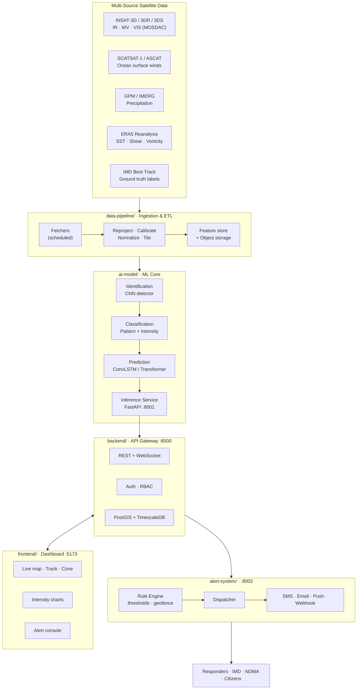

# Vayu-X — AI/ML Tropical Cyclone Intelligence System

> **Smart India Hackathon 2025** · Problem Statement **26070**
> **Team No.** 152 · **Team Name** Vayu-X

An AI/ML system for **identification**, **classification**, and **prediction** of tropical
cyclone patterns over the North Indian Ocean using **multi-source satellite data**.

| | |
|---|---|
| **Problem Statement ID** | 26070 |
| **Organization** | Ministry of Earth Sciences (MoES) |
| **Department** | India Meteorological Department (IMD) |
| **Category** | Software |
| **Theme** | Disaster Management |

---

## 1. Problem in one paragraph

IMD currently relies heavily on the **Dvorak technique** — a manual, analyst-driven method of
reading cloud patterns in satellite imagery to estimate cyclone intensity. It is subjective,
slow, and inconsistent between analysts. Meanwhile INSAT-3D/3DR alone push out a half-hourly
full-disk scan, and scatterometer, microwave, and reanalysis products add several more streams.
No human team can fuse all of that in real time. **Vayu-X automates the loop**: ingest
multi-source satellite data → detect and locate cyclonic systems → classify their pattern and
intensity → forecast track and intensity → push graded alerts to responders before landfall.

## 2. What the system does

| Stage | Capability | Approach |
|---|---|---|
| **Identify** | Detect and geo-locate cyclonic systems / eye centre from full-disk imagery | CNN + attention-based detector over IR (TIR-1), WV, and VIS channels |
| **Classify** | Cloud pattern type (CDO, banding, shear, eye, curved band) + intensity category (D, DD, CS, SCS, VSCS, ESCS, SuCS) | Deep classifier trained against IMD best-track / Dvorak T-number labels |
| **Predict** | Track (lat/lon) and intensity for T+6h … T+72h | ConvLSTM / spatio-temporal transformer over image sequences + reanalysis features |
| **Alert** | Graded, geo-fenced warnings to authorities and citizens | Rule engine over predictions → multi-channel dispatch (SMS / email / push / webhook) |
| **Visualize** | Live dashboard: satellite overlay, cyclone track, cone of uncertainty, intensity timeline | React + Leaflet geospatial dashboard |

## 3. Architecture



Full detail: [`docs/architecture.md`](docs/architecture.md)

## 4. Repository structure

```
SIH_Project/
├── frontend/          React + Vite dashboard (map, tracks, charts, alert console)
├── backend/           FastAPI API gateway — auth, orchestration, persistence, WebSocket
├── ai-model/          ML core — datasets, training, evaluation, inference microservice
├── alert-system/      Rule engine + multi-channel alert dispatcher
├── data-pipeline/     Satellite ingestion, ETL, feature store loading, scheduler
├── shared/            Cross-service JSON schemas (the service contract)
├── infra/             nginx, k8s manifests, monitoring configs
├── scripts/           Setup / bootstrap / sample-data helpers
├── docs/              Architecture, data sources, ML approach, API contract, roadmap
├── .github/           CI workflows, PR template
└── docker-compose.yml One-command local stack
```

Each service has its own `README.md` explaining its internals.

## 5. Tech stack

| Layer | Choice | Why |
|---|---|---|
| Frontend | React 18 + Vite, TailwindCSS, Leaflet, Recharts | Fast HMR, mature geospatial mapping, small bundle |
| Backend | FastAPI (Python 3.11), Pydantic, SQLAlchemy | Async, auto OpenAPI docs, same language as ML |
| Database | PostgreSQL + PostGIS + TimescaleDB | Geospatial queries + time-series cyclone tracks |
| Cache / Queue | Redis | Live state, pub/sub for WebSocket fan-out, task queue |
| ML | PyTorch, torchvision, xarray, rasterio, scikit-learn | Standard for satellite raster + deep learning |
| Serving | FastAPI + ONNX Runtime | Low-latency inference, framework-agnostic export |
| Object store | MinIO (S3-compatible) | Raw/processed satellite tiles |
| Alerts | Twilio (SMS), SMTP (email), FCM (push), webhooks | Redundant channels for disaster reliability |
| Orchestration | Docker Compose (dev) → Kubernetes (prod) | Portable, judge-friendly one-command demo |
| CI | GitHub Actions | Lint + test on every push |

> Every choice is swappable — services talk over HTTP using the contracts in `shared/schemas/`.

## 6. Data sources

| Source | Product | Use |
|---|---|---|
| **MOSDAC / ISRO** | INSAT-3D & 3DR — TIR-1, TIR-2, WV, VIS, MIR | Primary imagery for identification & classification |
| **ISRO / EUMETSAT** | SCATSAT-1, ASCAT ocean surface winds | Wind field, intensity cross-validation |
| **NASA / JAXA** | GPM IMERG precipitation | Rain-band structure |
| **ECMWF** | ERA5 reanalysis (SST, wind shear, vorticity, RH) | Environmental predictors for track/intensity |
| **IMD** | Best Track Data (RSMC New Delhi) | Ground-truth labels for supervised training |
| **NOAA** | IBTrACS global best track | Augmented training data, benchmarking |

Details, access notes, and licensing: [`docs/data-sources.md`](docs/data-sources.md)

## 7. Quick start

### Option A — Docker (recommended)

```bash
git clone https://github.com/<your-org>/SIH_Project.git
cd SIH_Project
cp .env.example .env
docker compose up --build
```

| Service | URL |
|---|---|
| Dashboard | http://localhost:5173 |
| Backend API + Swagger | http://localhost:8000/docs |
| Model inference API | http://localhost:8001/docs |
| Alert service | http://localhost:8002/docs |
| MinIO console | http://localhost:9001 |

### Option B — Manual

```bash
# 1. Backend
cd backend && python -m venv .venv && source .venv/bin/activate   # Windows: .venv\Scripts\activate
pip install -r requirements.txt && uvicorn app.main:app --reload --port 8000

# 2. Model service
cd ai-model && pip install -r requirements.txt
uvicorn src.serve.app:app --reload --port 8001

# 3. Alert system
cd alert-system && pip install -r requirements.txt
uvicorn src.main:app --reload --port 8002

# 4. Frontend
cd frontend && npm install && npm run dev
```

Bootstrap helpers: `scripts/setup.sh` (Linux/macOS) · `scripts/setup.ps1` (Windows)

## 8. Development workflow

```bash
git checkout -b feat/<short-description>
# work, then:
make lint && make test
git commit -m "feat(ai-model): add ConvLSTM track predictor"
git push -u origin feat/<short-description>
```

Branches: `main` (stable demo) ← `dev` (integration) ← `feat/*` · `fix/*` · `docs/*`
Conventions: [`CONTRIBUTING.md`](CONTRIBUTING.md)

## 9. Roadmap

| Phase | Deliverable | Status |
|---|---|---|
| 0 | Repo scaffold, architecture, service contracts | ✅ Done |
| 1 | Data pipeline — INSAT + best-track ingestion, labelled dataset | 🔄 In progress |
| 2 | Baseline identification + classification models | ⬜ Planned |
| 3 | Track & intensity prediction (ConvLSTM) | ⬜ Planned |
| 4 | Backend API + dashboard integration | ⬜ Planned |
| 5 | Alert engine + geofenced multi-channel dispatch | ⬜ Planned |
| 6 | Evaluation vs IMD best track, demo hardening | ⬜ Planned |

Detailed plan: [`docs/roadmap.md`](docs/roadmap.md)

## 10. Team Vayu-X — Team No. 152

| Role | Member | Owns |
|---|---|---|
| Team Lead / ML | _TBD_ | Model architecture, training |
| ML Engineer | _TBD_ | Data pipeline, feature engineering |
| Backend | _TBD_ | API gateway, database, integration |
| Frontend | _TBD_ | Dashboard, geospatial visualization |
| Alerts / DevOps | _TBD_ | Alert system, Docker, deployment |
| Research / Docs | _TBD_ | Domain research, evaluation, presentation |

## 11. Documentation index

| Doc | Contents |
|---|---|
| [`docs/architecture.md`](docs/architecture.md) | System design, data flow, component responsibilities |
| [`docs/data-sources.md`](docs/data-sources.md) | Satellite products, access, formats, preprocessing |
| [`docs/ml-approach.md`](docs/ml-approach.md) | Model designs, training strategy, evaluation metrics |
| [`docs/api-contract.md`](docs/api-contract.md) | REST/WebSocket endpoints across all services |
| [`docs/alerting.md`](docs/alerting.md) | Alert grading, thresholds, escalation, channels |
| [`docs/roadmap.md`](docs/roadmap.md) | Phase plan, milestones, ownership |

## 12. License

MIT — see [`LICENSE`](LICENSE). Satellite data remains under the licence of its respective
provider (ISRO/MOSDAC, IMD, NASA, ECMWF, NOAA); see `docs/data-sources.md`.

---

<sub>Built for Smart India Hackathon 2025 · Problem Statement 26070 · Ministry of Earth Sciences · Team Vayu-X (152)</sub>
