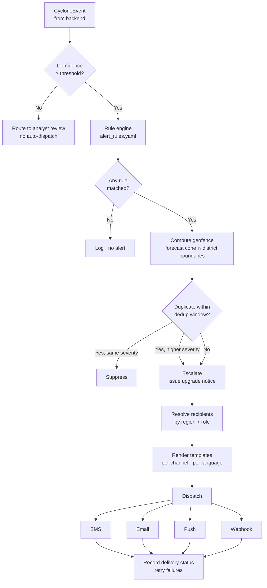

# Alert System Design — Vayu-X

A cyclone prediction that nobody acts on saves nobody. The alert system is what converts model
output into a delivered, geofenced, graded warning.

---

## 1. Severity ladder

Mirrors IMD's operational colour-coded warning system, so output is immediately familiar to
the people who would actually use it.

| Severity | Meaning | Typical trigger | Audience |
|---|---|---|---|
| 🟢 **GREEN** | No action — system monitored | Depression, no coastal threat | Analysts only |
| 🟡 **YELLOW** | Be updated — watch | CS/SCS within 72 h of coast | District authorities, analysts |
| 🟠 **ORANGE** | Be prepared — alert | SCS/VSCS within 36 h of coast | District admin, NDRF, responders, citizens |
| 🔴 **RED** | Take action — warning | VSCS+ within 24 h of landfall | All — full public dissemination |

Severity is a function of **intensity × proximity × time-to-landfall × forecast confidence** —
never intensity alone. A SuCS heading out to sea is not a red alert.

---

## 2. Decision flow



---

## 3. Rule definition

Rules are **data, not code** — `alert-system/config/alert_rules.yaml`. Meteorologists can tune
thresholds without a redeploy, and `POST /rules/reload` hot-reloads them.

```yaml
- id: vscs_landfall_36h
  description: VSCS or stronger forecast to make landfall within 36 hours
  severity: ORANGE
  conditions:
    intensity_category: [VSCS, ESCS, SuCS]
    hours_to_landfall: { max: 36 }
    min_confidence: 0.70
  channels: [sms, email, push, webhook]
  audience: [district_admin, responder, citizen]
  cooldown_minutes: 180
```

Every rule declares: what triggers it, how severe it is, who hears about it, through which
channels, and how often it may re-fire.

---

## 4. Geofencing

The alert is targeted, not broadcast nationwide.

1. Take the forecast track plus its uncertainty radii → build the **cone of uncertainty** polygon.
2. Buffer it by the wind-radius estimate (area experiencing damaging winds).
3. Intersect with district/taluk boundary shapefiles (`ai-model/data/external/`).
4. Recipients registered in intersecting regions receive the alert.

Result: an alert for a Odisha landfall reaches Puri and Kendrapara, not Kerala. Precision keeps
trust intact — over-broadcasting trains people to ignore warnings.

---

## 5. Channels

| Channel | Provider | Best for | Failure mode handling |
|---|---|---|---|
| **SMS** | Twilio (or Indian gateway / CAP-SMS) | Works on any phone, no internet — critical when networks degrade | Retry ×3, exponential backoff |
| **Email** | SMTP | District administration, formal record with attachments | Retry, queue on failure |
| **Push** | Firebase Cloud Messaging | Citizen app users, rich content + map deep-link | Silent-fail tolerated (SMS covers) |
| **Webhook** | HTTP POST + HMAC signature | Machine-to-machine — NDMA, state EOC, other dashboards | Retry with signed replay |

Channels are **independent**. One failing does not block the others. Each dispatch's status is
recorded per recipient per channel.

Extension points already scoped: IVR voice calls for low-literacy populations, community siren
triggers, and Common Alerting Protocol (CAP) XML output for interoperability with existing
government warning infrastructure.

---

## 6. Message design

Each alert renders per channel and per language (English + regional).

**SMS** — under 160 chars, no jargon, one action:

```
IMD/Vayu-X ORANGE ALERT: Very Severe Cyclone expected near Puri coast
by 9 Sep 9PM. Winds 90-100 kmph. Move to safe shelter. Do not go to sea.
```

**Push** — headline, severity colour, map deep-link, ETA countdown.

**Email** — full detail: track map, intensity forecast table, affected districts, recommended
actions, model confidence, issuing timestamp.

**Webhook** — structured JSON per `shared/schemas/alert.schema.json`.

Principles: lead with the action, not the meteorology; give a specific place and time; state
what to do, never just what will happen.

---

## 7. Anti-spam and trust

| Mechanism | Purpose |
|---|---|
| **Dedup window** (default 30 min) | Same event + same severity does not re-alert |
| **Cooldown per rule** | Rules cannot fire in a loop |
| **Escalation-only re-alerts** | Repeat messages only when severity *increases* |
| **Confidence gate** | Below threshold → analyst review queue, never auto-dispatch |
| **Manual override** | Analyst can issue, upgrade, or cancel any alert from the console |
| **Cancellation notices** | When a threat passes, an all-clear goes to the same recipients |
| **`ALERT_DRY_RUN=true`** | Default in development — logs instead of sending. Prevents accidental real dispatch during testing |

The dry-run default matters: a bug during a hackathon demo must never send real SMS to real people.

---

## 8. Audit trail

Every alert is fully reconstructable: which model version, which observation, which rule matched,
what geofence was computed, who it went to, which channel succeeded, who acknowledged, when it was
cancelled. This is a legal and operational requirement for any real disaster-management system,
and it is also how the team debugs false alarms.

---

## 9. Metrics that matter

| Metric | Target |
|---|---|
| **Lead time** — alert issued to landfall | Maximize; > 24 h for RED |
| **Delivery latency** — trigger to phone | < 60 s |
| **Delivery success rate** per channel | > 95 % |
| **False alarm rate** | Minimize — every false alarm erodes future compliance |
| **Missed events** | Near zero — a missed cyclone is unacceptable; bias toward over-warning at the *analyst* tier, precision at the *public* tier |
| **Acknowledgement rate** from responders | Track to verify the chain actually closed |

The asymmetry is deliberate: at the analyst level, catch everything. At the public level, be
precise — because public trust is the resource that actually gets people to evacuate.
