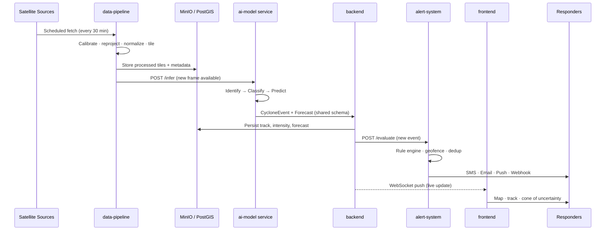
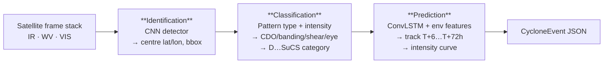
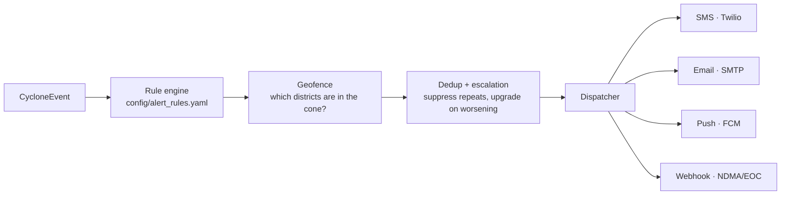
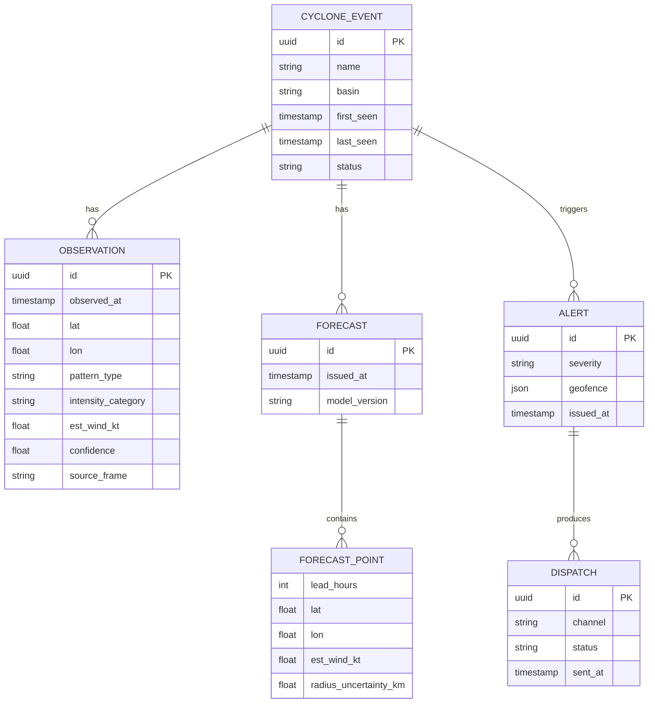

# System Architecture — Vayu-X

Problem Statement 26070 · Team 152 · Ministry of Earth Sciences / IMD

---

## 1. Design principles

| Principle | How it shows up |
|---|---|
| **Separation of concerns** | Ingestion, ML, API, alerts and UI are independent services with HTTP contracts |
| **Contract-first** | Every inter-service payload is defined in `shared/schemas/` before code is written |
| **Fail-safe over fail-silent** | Alert path has redundant channels; a model failure degrades to last-known-good, never to silence |
| **Reproducible ML** | Config-driven training, versioned checkpoints, deterministic seeds, logged experiments |
| **Demo-able in one command** | `docker compose up` brings the entire pipeline up on a laptop |

## 2. High-level flow

## 3. Components

### 3.1 `data-pipeline/` — Ingestion & ETL

**Responsibility:** get raw multi-source satellite data into a clean, model-ready form.

| Stage | Detail |
|---|---|
| **Ingest** | Per-source fetchers (`src/ingest/`): INSAT-3D/3DR (MOSDAC), SCATSAT/ASCAT winds, GPM IMERG, ERA5, IMD best track. Each implements a common `BaseFetcher` interface |
| **Transform** | Radiometric calibration → brightness temperature; reprojection to a common grid; bbox crop to North Indian Ocean; normalization; tiling into fixed-size patches |
| **Load** | Processed arrays → MinIO; metadata + best-track labels → PostGIS/TimescaleDB |
| **Schedule** | APScheduler cron loop (`src/scheduler.py`), default every 30 min matching INSAT full-disk cadence |

**Key decision:** the pipeline is *source-pluggable*. Adding a new satellite = one new fetcher class, no changes elsewhere.

### 3.2 `ai-model/` — ML core

Three chained models, one service.

| Model | Input | Output | Baseline architecture |
|---|---|---|---|
| Identification | Multi-channel image tile | Centre coordinates, bounding box, confidence | CNN backbone (ResNet/EfficientNet) + detection head |
| Classification | Cropped storm-centred patch | Pattern class + intensity category + est. wind speed | CNN / ViT classifier, multi-head (pattern + regression) |
| Prediction | Sequence of N past frames + ERA5 environmental features | Track points and intensity for T+6…T+72h with uncertainty | ConvLSTM encoder-decoder, or spatio-temporal transformer |

Serving: `src/serve/app.py` — FastAPI, loads ONNX/TorchScript checkpoints at startup, exposes `/infer`, `/identify`, `/classify`, `/predict`.

Details: [`ml-approach.md`](ml-approach.md)

### 3.3 `backend/` — API gateway

Single entry point for the UI and external consumers.

- REST API (`/api/v1/…`) — cyclones, predictions, alerts, imagery, auth
- WebSocket (`/ws`) — live push of new detections and alert state to dashboards
- Persistence — PostgreSQL + PostGIS (geometry) + TimescaleDB (time-series track/intensity hypertables)
- Orchestration — calls the model service, forwards results to the alert service
- Auth — JWT, role-based (`admin`, `analyst`, `responder`, `public`)

### 3.4 `alert-system/` — Warning dispatch

Deliberately a **separate service** so alerting keeps working even if the dashboard or model service is down.

Severity ladder mirrors IMD practice: **Green → Yellow → Orange → Red**.
Details: [`alerting.md`](alerting.md)

### 3.5 `frontend/` — Operations dashboard

| View | Contents |
|---|---|
| Live map | Satellite overlay, detected centre, historical track, forecast track, cone of uncertainty, affected-district geofence |
| Intensity panel | Observed vs predicted wind speed / pressure over time |
| Classification panel | Pattern type, category, model confidence, Dvorak-equivalent T-number |
| Alert console | Active alerts, severity, recipients, dispatch status, manual override |
| History | Past events, model-vs-best-track comparison |

## 4. Data model (core entities)

Canonical JSON representations live in [`shared/schemas/`](../shared/schemas/).

## 5. Deployment

| Environment | Setup |
|---|---|
| **Local / demo** | `docker compose up` — all services + Postgres + Redis + MinIO on one machine |
| **Staging** | Same compose file on a single cloud VM, nginx reverse proxy (`infra/nginx/`) |
| **Production sketch** | Kubernetes (`infra/k8s/`): stateless services horizontally scaled, GPU node pool for the model service, managed Postgres, S3 for objects, Prometheus + Grafana (`infra/monitoring/`) |

## 6. Reliability considerations

| Risk | Mitigation |
|---|---|
| Satellite feed outage | Pipeline retries with backoff; system falls back to last valid frame and flags data staleness in the UI |
| Model service down | Backend serves last persisted forecast, marked stale; alerts already dispatched remain valid |
| False positive alert | Confidence threshold + dedup window + human override in the alert console |
| Missed detection (false negative) | Ensemble of detection thresholds; low-confidence detections still surface to analysts as "review needed" |
| Alert channel failure | Four independent channels; dispatch status tracked per channel with retry |

## 7. Why this architecture wins on the evaluation criteria

- **Accuracy** — multi-source fusion beats single-channel Dvorak; trained against IMD best track
- **Timeliness** — fully automated 30-minute loop vs hours of manual analysis
- **Objectivity** — removes analyst-to-analyst variance in Dvorak estimation
- **Actionability** — output is not a number but a geofenced, graded, delivered warning
- **Extensibility** — new satellites, new models, new alert channels all plug in without redesign
