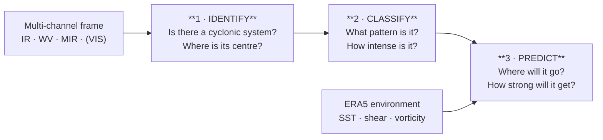

# ML Approach — Vayu-X

How we turn multi-source satellite imagery into identification, classification, and prediction.

---

## 1. The three tasks

PS 26070 asks for three distinct capabilities. We model them as a chained pipeline, each stage
independently trainable and evaluatable.



---

## 2. Task 1 — Identification (detection + localization)

**Goal:** from a full-disk or regional frame, output candidate cyclone centres with confidence.

| | |
|---|---|
| **Input** | Multi-channel tile, e.g. `[C, 256, 256]` — TIR-1, TIR-2, WV, MIR (+ VIS masked at night) |
| **Output** | `[(lat, lon, bbox, confidence), …]` |
| **Baseline** | CNN backbone (ResNet-50 / EfficientNet-B3) + detection head (anchor-free, CenterNet-style heatmap) |
| **Why heatmap** | A cyclone centre is a *point*, not a box — centre-heatmap regression fits the physics better than generic object detection |
| **Alternatives to try** | U-Net segmentation of the cyclonic cloud mass then centroid; DETR-style transformer detector |
| **Labels** | IMD best-track positions interpolated to frame timestamps |
| **Loss** | Focal loss on the centre heatmap + L1 on offset/size |
| **Metrics** | Probability of Detection (POD), False Alarm Rate (FAR), mean centre-location error in km |

**Target:** centre location error < 30 km, POD > 0.90 for systems ≥ Depression.

---

## 3. Task 2 — Classification (pattern + intensity)

**Goal:** given a storm-centred crop, name the cloud pattern and estimate intensity — i.e. do
automatically what the Dvorak technique does manually.

| | |
|---|---|
| **Input** | Storm-centred crop, e.g. `[C, 224, 224]`, rotated/normalized to a canonical orientation |
| **Output (head A)** | Pattern class: `curved_band`, `shear`, `CDO`, `banding_eye`, `eye`, `central_cold_cover` |
| **Output (head B)** | Intensity category: `D`, `DD`, `CS`, `SCS`, `VSCS`, `ESCS`, `SuCS` |
| **Output (head C)** | Regression: sustained wind (kt), central pressure (hPa), Dvorak-equivalent T-number |
| **Baseline** | Shared CNN/ViT trunk + three heads (multi-task learning) |
| **Why multi-task** | Pattern and intensity are physically coupled — a shared representation regularizes both and matches how a human analyst reasons |
| **Loss** | Cross-entropy (A, B, class-weighted) + Huber (C), weighted sum |
| **Metrics** | Pattern accuracy / macro-F1, category accuracy, wind RMSE (kt), pressure MAE (hPa) |

**Target:** intensity RMSE < 10 kt (comparable to trained-analyst Dvorak spread), category accuracy > 80 %.

**Handling class imbalance:** SuCS events are rare. Mitigations — class-weighted loss, oversampling
of severe cases, augmentation (rotation, flip, brightness jitter within physical bounds), and
pre-training on the global IBTrACS archive before fine-tuning on North Indian Ocean events.

---

## 4. Task 3 — Prediction (track + intensity forecast)

**Goal:** forecast position and intensity at T+6, 12, 24, 48, 72 h with an uncertainty envelope.

| | |
|---|---|
| **Input** | Sequence of N past storm-centred frames `[N, C, H, W]` + tabular environmental features (SST, 200–850 hPa shear, mid-level RH, 850 hPa vorticity, steering flow) + past track vector |
| **Output** | For each lead time: `(lat, lon, wind_kt, pressure_hpa, radius_uncertainty_km)` |
| **Baseline** | ConvLSTM encoder-decoder — convolutional layers capture spatial structure, recurrence captures evolution |
| **Stronger option** | Spatio-temporal transformer / attention over frame embeddings; or a hybrid: CNN frame encoder → temporal transformer → MLP forecast heads |
| **Physics-informed extras** | Feed steering flow explicitly; constrain track continuity (penalize physically impossible jumps) |
| **Uncertainty** | Monte-Carlo dropout or a small ensemble → spread becomes the "cone of uncertainty" radius shown on the dashboard |
| **Loss** | Haversine distance loss on track + Huber on intensity, weighted by lead time |
| **Metrics** | Track error (km) at each lead time; intensity MAE (kt); comparison against IMD official forecast error and a persistence/CLIPER baseline |

**Target (ambitious but the right benchmark):** 24 h track error < 100 km, competitive with or better
than the operational baseline on the same cases.

**Rapid intensification** is the hardest sub-problem and where an ML system can genuinely add
value — worth a dedicated binary head (`RI in next 24 h: yes/no`) trained on ocean-heat-content
and shear features.

---

## 5. Dataset construction

```
For each cyclone in IMD Best Track (last ~15 years):
    For each best-track timestamp t:
        pull INSAT frames at t (nearest within tolerance)
        crop storm-centred patch using best-track lat/lon
        attach labels: category, wind, pressure, pattern (Dvorak-derived)
        attach ERA5 environmental features at (t, lat, lon)
        attach future track points (t+6h … t+72h) as prediction targets
    → one sample per timestamp; sequences built by sliding window
```

**Splits — chronological, not random.** Random splits leak information (adjacent frames of the same
storm are nearly identical) and inflate scores.

| Split | Contents |
|---|---|
| Train | Older seasons |
| Validation | Held-out seasons |
| Test | Most recent seasons, plus named case studies (e.g. Amphan, Fani, Biparjoy, Tauktae) held out entirely |

**Negative samples** (non-cyclonic frames, monsoon depressions, ordinary convection) are essential so
the detector learns what is *not* a cyclone.

---

## 6. Training practices

| Practice | Why |
|---|---|
| Config-driven runs (`configs/*.yaml`) | Reproducibility — every run is fully described by a file |
| Fixed seeds, logged git SHA | A result can be traced back to exact code + config |
| Experiment tracking (MLflow / W&B) | Compare runs honestly instead of by memory |
| Mixed precision, gradient accumulation | Fit larger batches on limited GPU |
| Early stopping on validation, cosine LR schedule | Standard, avoids overfitting the small severe-storm tail |
| Checkpoints named `{task}_{arch}_{date}_v{n}` | Traceable serving artifacts |
| Export to ONNX for serving | Framework-independent, faster inference, smaller image |

---

## 7. Evaluation protocol

Evaluation is against **IMD best track**, on held-out seasons, reported as:

| Task | Reported metrics |
|---|---|
| Identification | POD, FAR, CSI, mean centre error (km), detection latency |
| Classification | Category accuracy, macro-F1, confusion matrix, wind RMSE, pressure MAE |
| Prediction | Track error by lead time (km), intensity MAE by lead time, skill vs persistence baseline |
| End-to-end | Alert lead time before landfall; false-alarm rate at operational thresholds |

**Baselines to beat:** persistence, CLIPER (climatology + persistence), and published automated
Dvorak (ADT) performance. A model is only interesting if it beats these.

**Case studies** for the demo and presentation: run the full pipeline over a historical severe
cyclone and show detection → classification → forecast → alert against what actually happened.

---

## 8. Explainability

Judges (and meteorologists) will not trust a black box on a disaster-management problem.

- **Grad-CAM / attention maps** overlaid on the satellite image — show *which* cloud features drove
  the intensity estimate. Displayed directly in the dashboard.
- **Feature attribution (SHAP)** on the environmental predictors for track/intensity forecasts.
- **Confidence surfaced everywhere** — every prediction carries a confidence value, and low
  confidence routes to "analyst review" rather than an automatic alert.
- **Dvorak cross-reference** — showing the model's T-number equivalent lets an IMD analyst sanity-check
  the output against a method they already trust.

---

## 9. Model roadmap

| Stage | Model | Purpose |
|---|---|---|
| M0 | Classical CV baseline (thresholding + spiral fit) | Sanity floor — proves the data pipeline works |
| M1 | ResNet classifier on single frames | First intensity estimates |
| M2 | CenterNet-style detector | Identification |
| M3 | Multi-task CNN/ViT | Pattern + intensity together |
| M4 | ConvLSTM | Track & intensity forecasting |
| M5 | Transformer / ensemble + uncertainty | Best accuracy, calibrated cone of uncertainty |

Ship M0–M2 early so the end-to-end system is demonstrable, then improve models behind a stable API.
